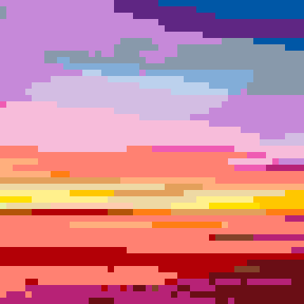
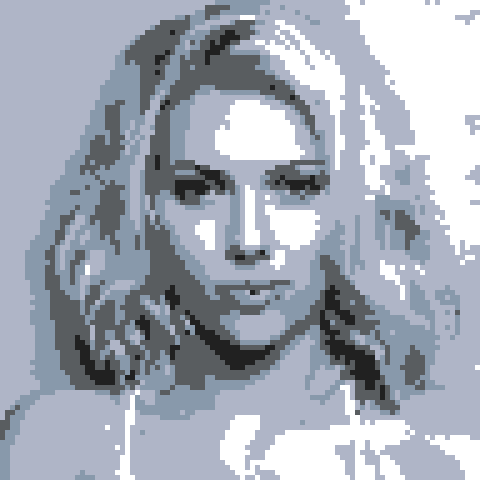
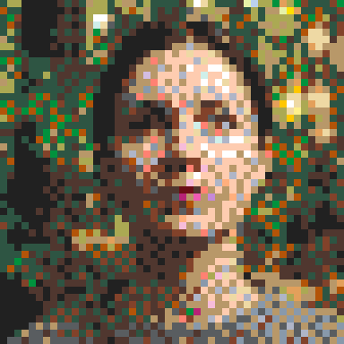

# legopic

Convert images to LEGO mosaic patterns with perceptual color matching.

[](https://github.com/zl3311/lego_image_converter/actions/workflows/ci.yml)
[](https://codecov.io/gh/zl3311/lego_image_converter)
[](https://pypi.org/project/legopic/)
[](https://pepy.tech/project/legopic)
[](https://pypi.org/project/legopic/)
[](https://github.com/zl3311/lego_image_converter/blob/main/LICENSE)
[](https://mypy-lang.org/)
[](https://github.com/astral-sh/ruff)

---

## ✨ New: Dithering Support

Create photo-realistic LEGO mosaics with **Floyd-Steinberg dithering** — perfect for portraits and images with smooth gradients!

| Original | Classic | Sharp | Dithered |
|:--------:|:-------:|:-----:|:--------:|
|  |  |  |  |
| Source image | Best for: logos | Best for: sharp edges | Best for: photos |

```python
session.convert("dithered")  # Just one line!
```

---

## Installation

```bash
pip install legopic
```

## Quick Start

### Basic Conversion

```python
from legopic import ConversionSession, Palette, load_image

# Load image and palette
image = load_image("photo.jpg")
palette = Palette.from_set(31197)  # Andy Warhol's Marilyn Monroe set

# Create session and convert
session = ConversionSession(image, palette, canvas_size=(48, 48))
session.convert()  # Uses "classic" profile by default

# Access result
print(f"Similarity score: {session.similarity_score:.2f}")
rgb_array = session.canvas.to_array()  # numpy array (48, 48, 3)

for row in session.canvas.cells:
    for cell in row:
        print(f"({cell.x}, {cell.y}): {cell.color.name}")
```

### Pipeline Profiles

Choose a conversion profile based on your image type:

```python
from legopic import ConversionSession, Palette, load_image

image = load_image("photo.jpg")
palette = Palette.from_set(31198)  # The Beatles

session = ConversionSession(image, palette, (48, 48))

# Classic: Mean pooling → nearest color match
session.convert("classic")  # Best for smooth gradients, logos

# Sharp: Match colors first → mode pooling
session.convert("sharp")  # Best for sharp edges, pixel art

# Dithered: Mean pooling → Floyd-Steinberg dithering
session.convert("dithered")  # Best for photos, portraits
```

| Profile | Pipeline | Best For |
|---------|----------|----------|
| `"classic"` | Pool (mean) → Quantize | Smooth gradients, logos |
| `"sharp"` | Quantize → Pool (mode) | Sharp edges, pixel art |
| `"dithered"` | Pool (mean) → Dither (Floyd-Steinberg) | Photos, portraits, gradients |

### Using All Standard LEGO Colors

```python
from legopic import ConversionSession, Palette, load_image

# Load all 41 standard (opaque) LEGO colors
palette = Palette.from_set()  # No set_id = all standard colors

image = load_image("photo.jpg")
session = ConversionSession(image, palette, (48, 48))
session.convert("dithered")  # Great for photos with full color range
```

### Using a Custom Palette

```python
from legopic import ConversionSession, Palette, Color, load_image

# Create a custom palette
palette = Palette([
    Color((255, 0, 0), "Red"),
    Color((0, 255, 0), "Green"),
    Color((0, 0, 255), "Blue"),
    Color((255, 255, 255), "White"),
    Color((0, 0, 0), "Black"),
])

image = load_image("photo.jpg")
session = ConversionSession(image, palette, canvas_size=(48, 48))
session.convert()
```

### Interactive Editing Workflow

```python
from legopic import ConversionSession, Palette, Color, load_image

image = load_image("photo.jpg")
palette = Palette.from_set(31197)
session = ConversionSession(image, palette, (48, 48))

# Initial conversion
session.convert("sharp")
print(f"Initial similarity: {session.similarity_score:.2f}")

# Pin a cell and change its color
custom_blue = Color((0, 100, 200), "Custom Blue")
session.pin(5, 10, custom_blue)  # Pin cell at (5, 10) to custom blue

# Bulk swap a color throughout the canvas
old_red = Color((179, 0, 6), "Red")
new_orange = Color((255, 126, 20), "Orange")
count = session.swap_color(old_red, new_orange)
print(f"Swapped {count} cells from red to orange")

# Re-convert with a different profile, preserving pinned cells
session.reconvert("classic", keep_pins=True)

# Get pinned cells
pinned = session.get_pinned_cells()
print(f"Pinned cells: {pinned}")
```

### Inventory-Limited Conversion

```python
from legopic import ConversionSession, Palette, load_image

image = load_image("photo.jpg")
palette = Palette.from_set(31197)  # Has specific element counts

session = ConversionSession(image, palette, (48, 48))

# Enable inventory limits - cells fall back to next-best color when preferred runs out
session.convert(
    pipeline="sharp",
    limit_inventory=True,
    algorithm="priority_greedy",  # Fast heuristic
)
```

### Custom Pipeline

For advanced users, create custom pipelines with fine-grained control:

```python
from legopic import ConversionSession, Palette, load_image
from legopic.pipeline import (
    Pipeline,
    PoolStep, PoolConfig, PoolMethod, ColorSpace,
    DitherStep, DitherConfig, DitherAlgorithm, ScanOrder,
)

image = load_image("photo.jpg")
palette = Palette.from_set(31197)

# Create a custom pipeline: LAB color space pooling + Atkinson dithering
custom_pipeline = Pipeline([
    PoolStep(PoolConfig(
        method=PoolMethod.MEAN,
        color_space=ColorSpace.LAB,  # Perceptually uniform averaging
    )),
    DitherStep(DitherConfig(
        algorithm=DitherAlgorithm.ATKINSON,  # Lighter, high-contrast
        order=ScanOrder.SERPENTINE,
        strength=0.8,  # 80% error diffusion
    )),
])

session = ConversionSession(image, palette, (48, 48))
session.convert(custom_pipeline)
```

**Available dithering algorithms:**
- `FLOYD_STEINBERG` — Classic, balanced (default)
- `ATKINSON` — Lighter, high-contrast
- `JARVIS_JUDICE_NINKE` — Smoother gradients
- `STUCKI` — High quality
- `SIERRA` / `SIERRA_LITE` — Sierra variants
- `BAYER` — Ordered dithering (parallelizable)

### Exporting for Building Guide

```python
from legopic import ConversionSession, Palette, load_image

image = load_image("photo.jpg")
palette = Palette.from_set(31197)
session = ConversionSession(image, palette, (48, 48))
session.convert()

# Bill of Materials
bom = session.get_bill_of_materials()
for entry in bom:
    status = "✓" if entry.in_palette else "⚠ custom"
    print(f"{entry.color.name}: {entry.count_needed} tiles {status}")

# Grid data for rendering
grid = session.get_grid_data()
for y, row in enumerate(grid):
    for x, cell_data in enumerate(row):
        print(f"({x},{y}): {cell_data.color.name}, ΔE={cell_data.delta_e:.1f}")

# Similarity map (identify problem areas)
sim_map = session.get_similarity_map()
max_delta_e = max(max(row) for row in sim_map)
print(f"Worst color match: ΔE={max_delta_e:.1f}")
```

### Exporting to External Platforms

Export your parts list directly to BrickLink or Rebrickable for easy ordering:

```python
from legopic import ConversionSession, Palette, load_image

image = load_image("photo.jpg")
palette = Palette.from_set(31197)
session = ConversionSession(image, palette, (48, 48))
session.convert()

# Export to BrickLink XML (for wanted list upload)
xml = session.export_bricklink_xml()
with open("wanted_list.xml", "w") as f:
    f.write(xml)

# Export to Rebrickable CSV (for parts list import)
csv = session.export_rebrickable_csv()
with open("parts_list.csv", "w") as f:
    f.write(csv)
```

The exports include platform-specific color IDs so you can directly upload to:
- **[BrickLink](https://www.bricklink.com)** — Upload XML as a Wanted List
- **[Rebrickable](https://rebrickable.com)** — Import CSV as a Parts List

## Available LEGO Sets

The package includes data for official LEGO Art sets:

| Set ID | Name | Canvas Size |
|--------|------|-------------|
| 31197 | Andy Warhol's Marilyn Monroe | 48×48 |
| 31198 | The Beatles | 48×48 |
| 31202 | Disney's Mickey Mouse | 48×48 |
| 31203 | World Map | 128×80 |
| 31204 | Elvis Presley "The King" | 48×48 |
| 21226 | Art Project – Create Together | 48×48 |

```python
from legopic.data import list_available_sets, get_set_dimensions

# List all sets
for set_id, name in list_available_sets():
    width, height = get_set_dimensions(set_id)
    print(f"{set_id}: {name} ({width}×{height})")
```

## Features

### Color Matching

Uses the Delta E (CIE2000) perceptual color distance metric via `basic_colormath`, which accounts for non-linearities in human vision perception.

### Pipeline Profiles

| Profile | Description | Best For |
|---------|-------------|----------|
| `"classic"` | Average pixel colors, then match to palette | Smooth gradients |
| `"sharp"` | Match each pixel, take most common | Sharp edges, distinct colors |
| `"dithered"` | Average pixels, then apply error diffusion | Photos, portraits, gradients |

### Dithering Algorithms

Error diffusion dithering creates the illusion of more colors by strategically placing available colors:

| Algorithm | Description |
|-----------|-------------|
| Floyd-Steinberg | Classic, balanced error diffusion |
| Atkinson | Lighter, high-contrast (loses 25% error intentionally) |
| Jarvis-Judice-Ninke | Smoother gradients (larger kernel) |
| Stucki | High quality, similar to Jarvis |
| Sierra / Sierra Lite | Fast approximations |
| Bayer | Ordered dithering (not error diffusion, parallelizable) |

### Dimension Validation

For uniform stride downsampling, image and canvas dimensions must satisfy:

```
image_width // canvas_width == image_height // canvas_height
```

This ensures every canvas cell maps to image pixels with a uniform block size.

**Valid examples:**
- Image 100×100 → Canvas 10×10 ✓
- Image 100×91 → Canvas 10×10 ✓ (last row has 1 pixel)

**Invalid examples:**
- Image 100×90 → Canvas 10×10 ✗ (height stride differs)
- Image 92×101 → Canvas 10×10 ✗ (width stride differs)

## About LEGO Mosaics

### What Are LEGO Mosaics?

LEGO mosaics are pixel-art style creations built using 1×1 round tiles (commonly called "studs" or "dots"). Each tile represents a single pixel, and when arranged on a baseplate, they form a cohesive image — similar to pointillism or cross-stitch patterns.

The official **LEGO Art** line (sets like 31197, 31198, etc.) popularized this technique, offering curated color palettes and building instructions for iconic portraits and artwork.

### The 1×1 Round Tile (Element 98138)

The primary building block for LEGO mosaics is the **1×1 round plate** with design ID **98138**. This element:

- Has a smooth, circular top surface
- Sits flat on baseplates and standard LEGO bricks
- Comes in 40+ official colors
- Creates the characteristic "dotted" mosaic appearance

### Where to Buy LEGO Tiles

Once you've designed your mosaic with `legopic`, you'll need to source the actual bricks. Here are the main marketplaces:

| Marketplace | Description |
|-------------|-------------|
| [BrickLink](https://www.bricklink.com/v2/search.page?q=98138#T=A) | The largest secondary LEGO marketplace. Search by element ID (98138) to find tiles in any color. |
| [BrickOwl](https://www.brickowl.com/search/catalog?query=98138) | Alternative marketplace with competitive pricing and international sellers. |
| [LEGO Pick-a-Brick](https://www.lego.com/pick-and-build/pick-a-brick) | Official LEGO store. Limited color selection but guaranteed authenticity. |

**Pro tip**: Use `session.export_bricklink_xml()` to generate a ready-to-upload wanted list for BrickLink, or `session.export_rebrickable_csv()` for Rebrickable. No manual counting needed!

### Contributing New Colors & Sets

The LEGO color palette evolves over time, and new Art sets are released regularly. **We welcome community contributions!**

If you'd like to add:
- **New colors** — Add entries to `src/legopic/data/colors.csv`
- **New sets** — Add set info to `sets.csv` and element mappings to `elements.csv`

See the [Contributing](#contributing-new-colors-or-sets) section for validation rules and submit a PR. The CI will automatically verify data integrity.

## API Reference

### Main API

| Class | Description |
|-------|-------------|
| `ConversionSession(image, palette, canvas_size)` | Main workflow manager for conversion |

### Pipeline

| Class/Function | Description |
|----------------|-------------|
| `Pipeline(steps, name=None)` | Custom pipeline with ordered steps |
| `PoolStep(config)` | Spatial downsampling step |
| `QuantizeStep(config)` | Color quantization (nearest match) |
| `DitherStep(config)` | Error diffusion dithering |
| `get_profile(name)` | Get built-in profile by name |
| `list_profiles()` | List available profile names |

### Models

| Class | Description |
|-------|-------------|
| `Color(rgb, name=None)` | RGB color with optional name |
| `Element(element_id, design_id, variant_id, count=None)` | LEGO element variant for inventory tracking |
| `Cell(color, x=None, y=None)` | Single pixel/block with position |
| `Image(array)` | Input image wrapper |
| `Canvas(width, height)` | Output mosaic grid |
| `Palette(colors)` | Collection of available colors with element variants |
| `BOMEntry` | Bill of materials entry for export |
| `CellData` | Cell data for grid export |

### ConversionSession Methods

| Method | Description |
|--------|-------------|
| `convert(pipeline="classic", limit_inventory=False, algorithm="priority_greedy")` | Run initial conversion |
| `reconvert(pipeline=None, keep_pins=True)` | Re-convert preserving pinned cells |
| `pin(x, y, new_color=None)` | Pin a cell, optionally changing its color |
| `unpin(x, y)` | Unpin a cell |
| `swap_color(old, new, pin=True)` | Bulk swap all cells of one color |
| `get_pinned_cells()` | Get list of (x, y) pinned coordinates |
| `get_bill_of_materials()` | Get BOM for building guide |
| `get_grid_data()` | Get 2D cell data for rendering |
| `get_similarity_map()` | Get per-cell Delta E values |
| `export_bricklink_xml()` | Export BOM as BrickLink XML wanted list |
| `export_rebrickable_csv()` | Export BOM as Rebrickable CSV parts list |

### ConversionSession Properties

| Property | Description |
|----------|-------------|
| `image` | Source image (read-only) |
| `palette` | Available colors (read-only) |
| `canvas_size` | Target dimensions (read-only) |
| `canvas` | Current conversion result |
| `similarity_score` | Average Delta E across all cells |

### Palette Methods

| Method | Description |
|--------|-------------|
| `Palette.from_set(set_id=None, standard_only=True)` | Load from LEGO set or all colors |
| `palette.colors` | List of unique Color objects |
| `palette.elements` | List of all Element objects |
| `palette.get_elements_for_color(color)` | Get element variants for a color |

### Canvas Methods

| Method | Description |
|--------|-------------|
| `Canvas.from_set(set_id)` | Create empty canvas with set dimensions |
| `canvas.get_cell(x, y)` | Get cell at coordinates |
| `canvas.to_array()` | Convert to numpy RGB array |

### Utility Functions

| Function | Description |
|----------|-------------|
| `load_image(source)` | Load from file path or URL |
| `match_color(targets, palette)` | Raw color matching utility |
| `export_bricklink_xml(bom)` | Export BOM list to BrickLink XML format |
| `export_rebrickable_csv(bom)` | Export BOM list to Rebrickable CSV format |

## Development

### Setup

```bash
# Clone the repository
git clone https://github.com/zl3311/lego_image_converter.git
cd lego_image_converter

# Install with uv (recommended)
uv sync --all-groups

# Or with pip
pip install -e ".[dev]"
```

### Testing

```bash
# Run all tests
uv run pytest

# Run with coverage
uv run pytest --cov=legopic --cov-report=term-missing
```

### Code Quality

```bash
# Lint
uv run ruff check src/ tests/

# Format
uv run ruff format src/ tests/

# Type check
uv run mypy src/legopic/
```

### Contributing New Colors or Sets

When adding new LEGO colors or sets via PR, the CI automatically validates data integrity. The following checks run on every PR:

#### `colors.csv` Validation
| Check | Description |
|-------|-------------|
| Unique `element_id` | Primary key must be unique |
| No exact duplicates | Same (design_id, name, r, g, b, variant_id) not allowed |
| Consistent RGB per name | Same color name must have same RGB values |
| Valid RGB range | Values must be integers in [0, 255] |
| Valid `is_standard` | Must be "true" or "false" |
| Valid `variant_id` | Must be a positive integer |

#### `sets.csv` Validation
| Check | Description |
|-------|-------------|
| Unique `set_id` | Primary key must be unique |
| Unique names | Set names should not duplicate |
| Valid dimensions | Width and height must be positive integers |
| Dimension limits | Canvas cannot exceed 1024×1024 studs |

#### `elements.csv` Validation
| Check | Description |
|-------|-------------|
| Unique pairs | (set_id, element_id) must be unique |
| Valid `element_id` | Must exist in `colors.csv` |
| Valid `set_id` | Must exist in `sets.csv` |
| Valid count | Must be a positive integer |

#### Cross-file Consistency
| Check | Description |
|-------|-------------|
| Sets have elements | Every set must have at least one element |
| Consistent `design_id` | Must match between `colors.csv` and `elements.csv` |

Run these checks locally before submitting:

```bash
uv run pytest tests/unit/test_data_integrity.py -v
```

## Background

This project was born from a passion for LEGO Art and the desire to create custom mosaic portraits.

Originally created for [LEGO Art Project 21226](https://www.lego.com/en-us/product/art-project-create-together-21226) — a collaborative set designed for creative freedom — this package helps you prototype LEGO mosaic designs by:

1. **Converting any image** to the constrained color palette of available LEGO tiles
2. **Downsizing intelligently** to your target canvas dimensions (e.g., 48×48 studs)
3. **Using perceptually accurate color matching** via the CIEDE2000 algorithm
4. **Dithering for photo-realism** using error diffusion algorithms

Whether you're recreating a family photo, a pet portrait, or pixel art, `legopic` lets you preview exactly how your design will look before ordering hundreds of tiles. No more guesswork — just load an image, pick a palette, and see the result instantly.

### Why Perceptual Color Matching?

Simple RGB distance doesn't account for how humans actually perceive color. Two colors might be mathematically similar but look completely different to our eyes. `legopic` uses the **Delta E (CIE2000)** metric, which models human vision to find the closest *perceptual* match — resulting in mosaics that look right, not just mathematically correct.

### Why Dithering?

With a limited palette (often just 10-15 colors), smooth gradients can look blocky. **Dithering** strategically places available colors to create the *illusion* of intermediate tones — the same technique used in classic video games and print media. The result? More detailed, photo-realistic mosaics from the same set of tiles.

## License

MIT License - see [LICENSE](LICENSE) for details.
